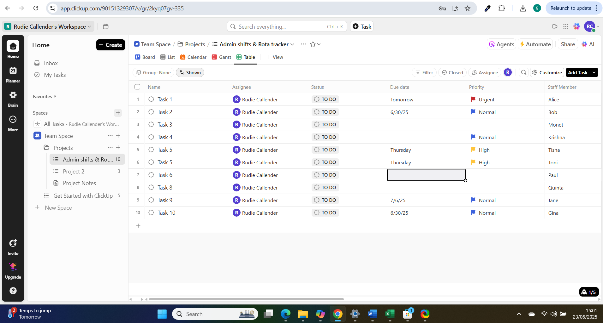

# clickUp-admin-rota-project
A staff rota and task planner built using ClickUp
# ClickUp Admin Rota & Task Tracker

This is a sample project showcasing how ClickUp can be used to manage weekly staff shift schedules and daily administrative tasks.

## 🗂️ Features

- Custom dropdowns for staff, shifts, days, and task status
- Visual status tracking using color-coded fields
- Break and paid hour tracking per shift
- Ideal for administrative, rota coordinator, and operations support roles

## 📸 Preview

> The following screenshots show the full ClickUp-based rota and task tracker (broken into 3 parts):
> **Part 1:**

**Part 2:**

**Part 3:**

## 🔧 Tools Used

- ClickUp (Free Plan)
- GitHub for version tracking and portfolio

## 🔗 Why It Matters

ClickUp is used in many corporate admin teams. This project simulates rota creation, task allocation, and shift planning in a real-world admin setting.
